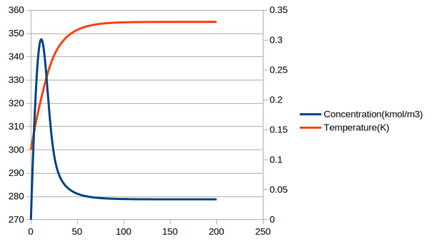

# Dynamic Non-Isothermal CSTR Simulator

## 📌 Project Overview
This project is an Object-Oriented C++ simulation tool designed to model the dynamic transient response of a non-isothermal Continuous Stirred-Tank Reactor (CSTR). It solves coupled, non-linear Ordinary Differential Equations (ODEs) for mass and energy balances to predict concentration and temperature profiles over time.

## ⚙️ Core Engineering Concepts
The simulator models an exothermic first-order reaction ($A \rightarrow B$) using the following principles:
* **Arrhenius Kinetics:** Temperature-dependent reaction rates.
* **Mass Balance:** Tracking the accumulation and consumption of reactant A.
* **Energy Balance:** Accounting for sensible heat, exothermic heat generation, and jacket cooling heat removal.

The system is defined by these governing differential equations:
1. **Mass Balance:**
   $$\frac{dC_A}{dt} = \frac{F}{V}(C_{A0} - C_A) - k C_A$$
2. **Energy Balance:**
   $$\frac{dT}{dt} = \frac{F}{V}(T_{0} - T) + \frac{(-\Delta H_{rxn})}{\rho C_p} k C_A - \frac{UA}{\rho C_p V}(T - T_c)$$

## 💻 Computational Approach
* **Language:** C++
* **Numerical Method:** Runge-Kutta 4th Order (RK4) integration algorithm.
* **Architecture:** Object-Oriented design separating the `CSTRModel` (physical parameters and ODE definitions) from the `RK4Solver` (numerical integration logic).
* **Data Handling:** Exports continuous time-series data directly to a `.csv` file for external parametric analysis and visualization.

## 📊 Results & Visualization
Running the simulation generates a time-series dataset showing the reactor's startup phase, the ignition of the exothermic reaction, and the eventual stabilization at steady-state conditions.

## 🚀 How to Run
1. Clone the repository.
2. Compile the C++ code using any standard compiler (e.g., GCC):
   `g++ main.cpp -o main && ./main`
3. Execute the program:
   `./main`
4. The output `reactor_simulation_results.csv` will be generated in the root directory. Open this in Excel, MATLAB, or LibreOffice Calc to visualize the response curves.
